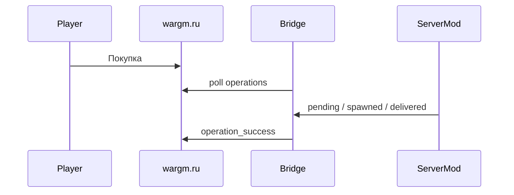

# Архитектура ShopClaim

| Компонент | Роль |
|-----------|------|
| **Bridge** | Poll WarGM API, SQLite очередь, каталог YAML, REST для server mod |
| **Server mod** | Выдача container/vehicle в DayZ |
| **Client mod** | GUI (`@ShopClaim_GUI` в dev), theme PBO `@ShopClaimTheme` |
| **Portal** | Multi-tenant ЛК, редактор каталога, биллинг (опционально) |

Каталог `catalog/offers.yaml` задаёт ClassName для выдачи; Bridge на `127.0.0.1` в self-hosted режиме.

См. [bridge/README.md](../bridge/README.md), [mod/README.md](../mod/README.md).
